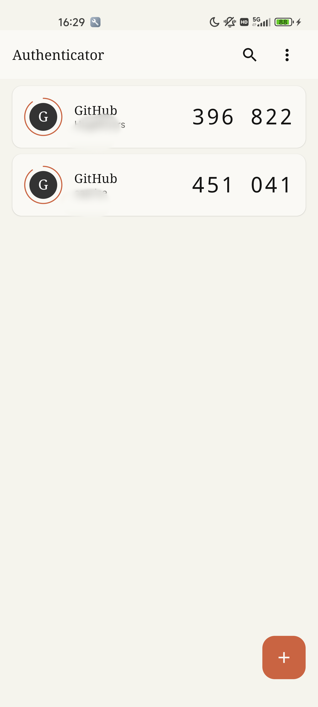
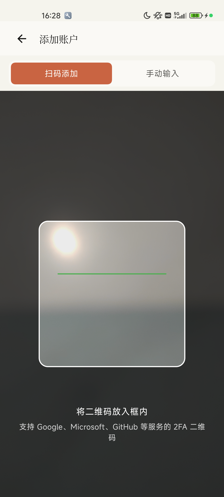
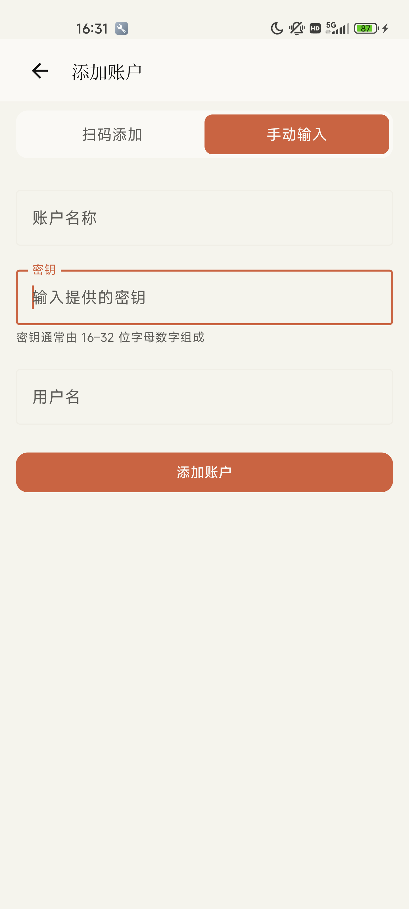
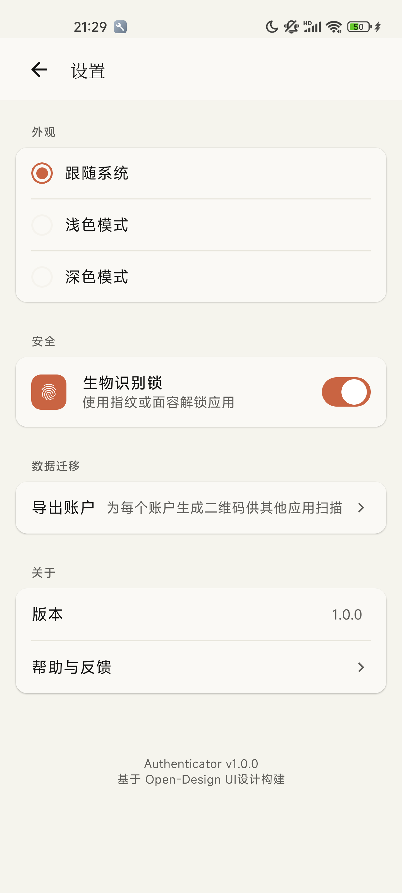
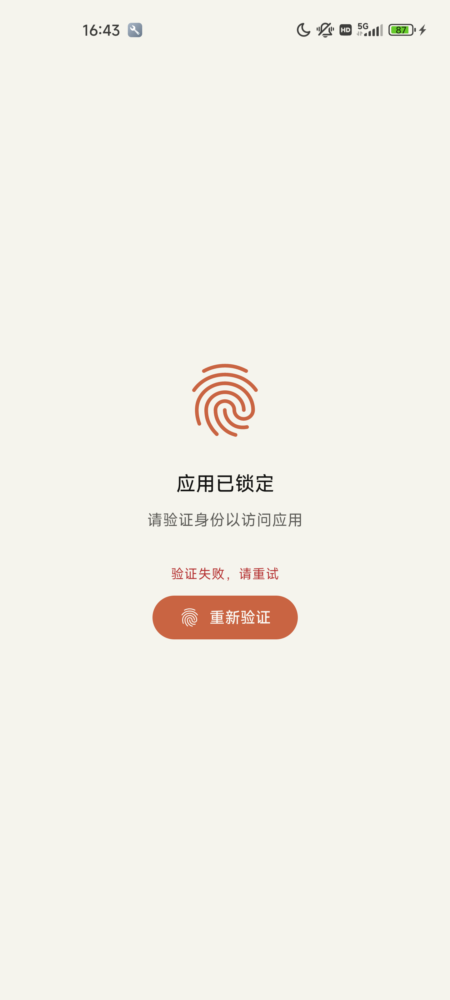
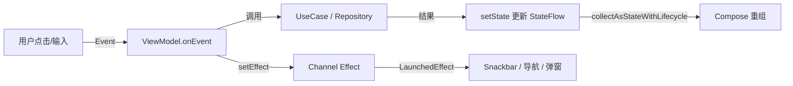

# Authenticator

一款基于 Jetpack Compose + MVI 的 Android 双因素认证（2FA）应用。支持 TOTP 验证码生成、二维码扫码添加、手动输入密钥、账户管理、主题切换与生物识别锁定。

<p align="center">
  
  
  
  
  
</p>

---

## 功能特性

- **TOTP 验证码生成**：基于时间和共享密钥，每 30 秒自动刷新一次 6 位验证码。
- **扫码添加账户**：调用 CameraX + ML Kit 扫描二维码，自动解析 `otpauth://` 协议。
- **手动输入密钥**：当无法扫码时，可手动填写账户名、用户名和 Secret。
- **账户管理**：支持搜索、复制验证码、查看账户详情、删除账户。
- **主题切换**：跟随系统 / 浅色 / 深色三种模式。
- **生物识别锁定**：支持指纹或面容解锁，保护你的 2FA 密钥安全。
- **时间漂移检测**：当设备时间与标准时间差距较大时给出提示。
- **本地安全存储**：账户数据通过 Room 持久化，设置项通过 DataStore 存储。

---

## 技术栈

| 层级 | 技术 |
|------|------|
| 语言 | Kotlin 2.2.10 |
| UI | Jetpack Compose (BOM 2025.06.01) + Material3 |
| 架构 | MVI（单向数据流） |
| 依赖注入 | Hilt 2.57 |
| 本地存储 | Room 2.7.1 + DataStore 1.1.4 |
| 相机扫码 | CameraX 1.5.0 + ML Kit Barcode Scanning 17.3.0 |
| 生物识别 | BiometricPrompt 1.1.0 |
| 导航 | Navigation Compose 2.9.1 |
| 构建 | Gradle 8.12、KSP、minSdk 26 / targetSdk 36 |

---

## 项目结构

```
app/src/main/kotlin/com/hgr/authenticator/
├── data/
│   ├── local/              # Room 数据库、DataStore
│   └── repository/         # 仓库实现
├── di/                     # Hilt 模块
├── domain/
│   ├── model/              # Account、ThemeMode、AppSettings 等
│   ├── repository/         # 仓库接口
│   └── usecase/            # 生成验证码、增删账户、设置读写等
├── presentation/
│   ├── base/               # MVI 基础组件（UiState/UiEvent/UiEffect/BaseViewModel）
│   ├── home/               # 首页
│   ├── addaccount/         # 添加账户
│   ├── settings/           # 设置
│   ├── components/         # 纯 UI 组件
│   ├── navigation/         # 导航图
│   └── theme/              # 主题与配色
└── utils/                  # 工具类
```

---

## MVI 架构

应用采用标准 MVI 单向数据流：



- **State**：UI 的完整快照，不可变，通过 `StateFlow` 暴露。
- **Event**：用户意图或系统事件，唯一入口是 `ViewModel.onEvent(event)`。
- **Effect**：一次性副作用（如导航、Toast、Snackbar），通过 `Channel` 消费后消失，避免旋转屏幕重复触发。

核心基类见 `presentation/base/BaseViewModel.kt`。

---

## 快速开始

### 环境要求

- Android Studio Meerkat 或更新版本
- JDK 21
- Android SDK 36
- 一部运行 Android 8.0（API 26）或更高版本的真机/模拟器

### 构建与运行

1. 克隆仓库：

```bash
git clone https://github.com/HugeRivers/Authenticator.git
cd Authenticator
```

2. 使用 Android Studio 打开项目，等待 Gradle 同步完成。

3. 点击 **Run ▶** 运行 `app` 模块。

### 发布构建

Release 构建需要一个签名配置。你可以在项目根目录创建 `keystore.properties`：

```properties
keyAlias=your_key_alias
keyPassword=your_key_password
storeFile=path/to/your.keystore
storePassword=your_store_password
```

或者通过环境变量配置：

```bash
export RELEASE_KEY_ALIAS=your_key_alias
export RELEASE_KEY_PASSWORD=your_key_password
export RELEASE_STORE_FILE=path/to/your.keystore
export RELEASE_STORE_PASSWORD=your_store_password
```

然后执行：

```bash
./gradlew :app:assembleRelease
```

---

## 测试

项目包含单元测试与 Compose UI 测试：

```bash
# 运行单元测试
./gradlew :app:testDebugUnitTest

# 运行 Android 仪器测试
./gradlew :app:connectedDebugAndroidTest
```

---

## 安全提示

- 本应用将 2FA Secret 以加密前的原始形式存储在本地数据库中，用于生成验证码。请妥善保管设备安全。
- 生物识别锁定仅作为应用层防护，不能替代系统级加密。
- 建议定期备份重要账户的恢复码，避免设备丢失导致无法登录。

---

## 为什么做这个项目

起因是公司内部系统需要 2FA，但现有的 Authenticator 应用在可用性、迁移便利性、Secret 查看和生物识别保护等方面总有一些不尽人意的地方。于是决定自己动手，用最新的 Jetpack Compose 和 MVI 架构做一款干净、可控的双因素认证工具。

---

## 许可证

```
Copyright 2026 HGR

Licensed under the Apache License, Version 2.0 (the "License");
you may not use this file except in compliance with the License.
You may obtain a copy of the License at

    http://www.apache.org/licenses/LICENSE-2.0

Unless required by applicable law or agreed to in writing, software
distributed under the License is distributed on an "AS IS" BASIS,
WITHOUT WARRANTIES OR CONDITIONS OF ANY KIND, either express or implied.
See the License for the specific language governing permissions and
limitations under the License.
```

---

*Made with Jetpack Compose and ☕*
